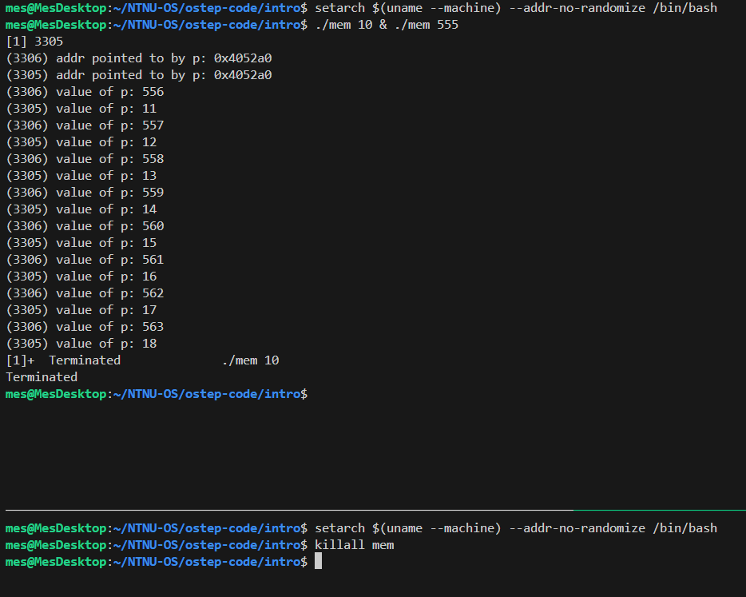
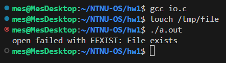
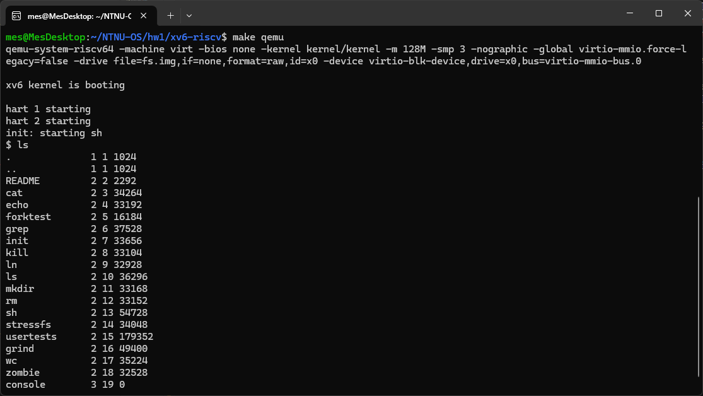

41347903S 鄭詠澤

# 1 Further study on process switching

With direct execution is achieving a switch between processes, if a process is running on the CPU, this by definition means the OS is not running. Thus, OS need a method to regain the control of the CPU.

There are 2 approaches, Cooperative and Non-Cooperative Approach. Timer interrupt was introduced from the second approach. 

A timer device can be programmed to raise an interrupt every so many milliseconds; when the interrupt is raised, the currently running process is halted, and a pre-configured interrupt handler in the OS runs.

At this point, the OS has regained control of the CPU, and thus can decide to stop the current process or start a different one.

# 2 Basic concepts of terminal and shell

## 2.1 Screenshot



## 2.2 Explanation

In a Unix-like system, each process is identified by a unique process ID (PID) and managed by the OS itself, rather than being tied to a particular terminal.

When we issue a kill command from any terminal, it sends a signal to the target process’s PID. As long as the user running the kill command has sufficient privileges (for example, the same user that started the process or the superuser), the OS will deliver the signal to the process, causing it to terminate. 

Because the OS abstracts away the terminal association of processes—meaning, it only cares about the PID and not which terminal launched it—processes can be killed from any terminal session with the appropriate permissions.

# 3 Learning from the Linux man pages

The us (user), sy (system), and id (idle) fields refer to how the CPU is spending its time:

- **us** : time running un-niced user processes
- **sy** : time running kernel processes
- **ni** : time running niced user processes
- **id** : time spent in the kernel idle handler
- **wa** : time waiting for I/O completion
- **hi** : time spent servicing hardware interrupts
- **si** : time spent servicing software interrupts
- **st** : time stolen from this vm by the hypervisor

The `us` value shows the percentage of CPU time spent running processes in user space (i.e., non-kernel applications), the `sy` value shows the percentage of CPU time spent running kernel processes or system calls, and the `id` value represents the percentage of CPU time that is idle (i.e., not doing any work).

# 4 I/O and system calls

The man page said

> **EEXIST** pathname already exists and O_CREAT and O_EXCL were used.

and for `O_CREAT` and `O_EXCL`:

> **O_CREAT**:If pathname does not exist, create it as a regular file.

>  **O_EXCL**: Ensure that this call creates the file: if this flag is specified in conjunction with O_CREAT, and pathname already exists, then open() fails with the error EEXIST.

Thus, to trigger an EEXIST error, we need to open an already-existing file with both O_CREAT and O_EXCL:

```c
#include <stdio.h>
#include <unistd.h>
#include <fcntl.h>
#include <errno.h>
#include <string.h>

int main(int argc, char *argv[]) {
    int fd = open("/tmp/file", O_WRONLY | O_CREAT | O_EXCL, S_IRUSR | S_IWUSR);
    if (fd < 0) {
        if (errno == EEXIST) {
            perror("open failed with EEXIST");
        } else {
            perror("open failed");
        }
        return 1;
    }
    close(fd);
    return 0;
}
```

To test it, we have to ensure that `/tmp/file` already exists, we can do it by running `touch /tmp/file` command. 

Then because the file is already there, `open()` will fail with the error `EEXIST`. The reason it happens is that `O_EXCL` explicitly tells open() to fail if the file is already present, thus preventing accidental overwrites.

Test output:



# 5 Setting up xv6

