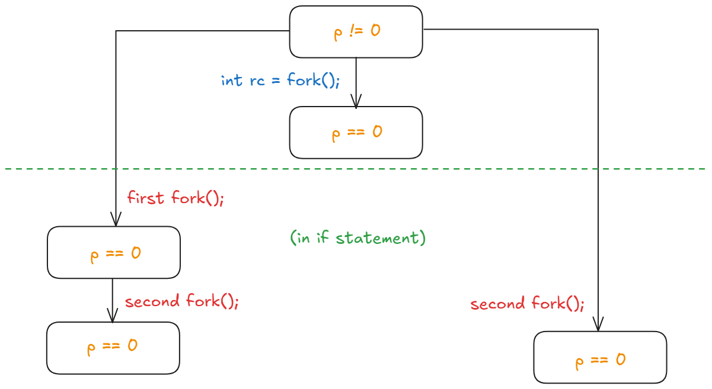
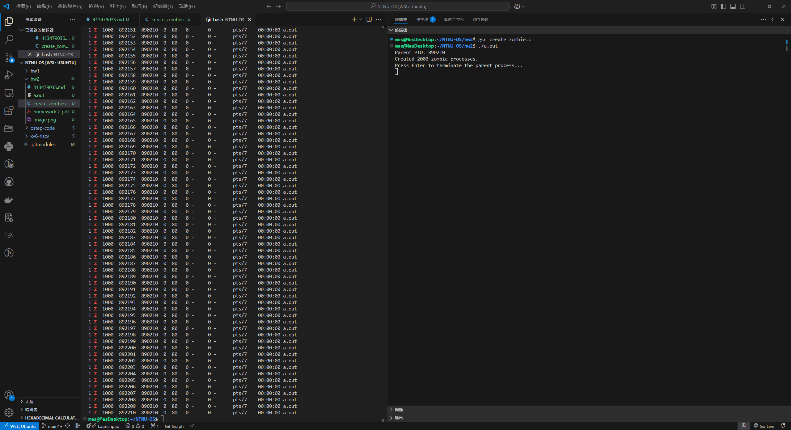
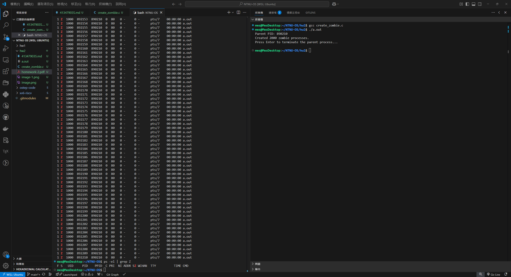
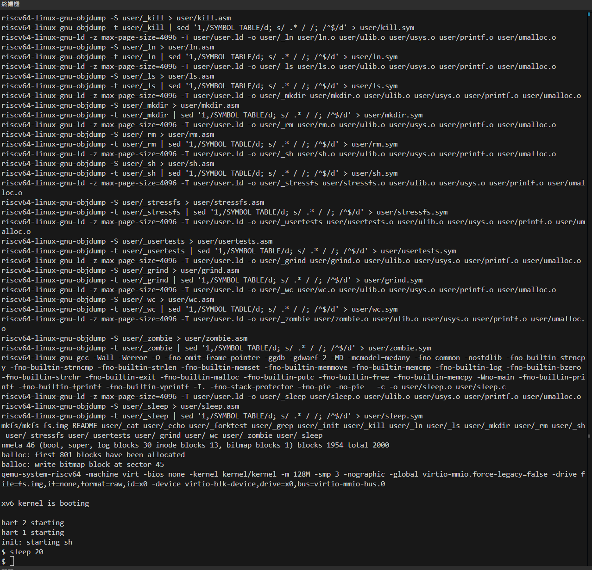

41347903S 鄭詠澤

# 1 OS booting sequence

One crucial step is to update the page table base register(the `satp` register in RISC-V). In xv6, before jumping to user mode, it must load the new process’s page table by writing its address into `satp`.

The key point is:

- Memory Isolation: By updating `satp`, the OS can ensure that when the CPU switches to user mode, it uses the correct user-space page table. This sets up the virtual-to-physical address mappings so that the process can only access its own memory space.
- Security and Correctness: Without reloading `satp`, the CPU might continue using the kernel’s page table. This could lead to the process having unintended access to kernel memory or encountering incorrect memory mappings, which would compromise both the security and stability of the system.
- Proper Address Translation: The user-space program relies on the correct mapping of its code, data, and stack. Loading the new page table ensures that all user-mode memory references are translated appropriately.

Specifically, the code phase was in `usertrapret`:

```c
// tell trampoline.S the user page table to switch to.
uint64 satp = MAKE_SATP(p->pagetable);

// jump to userret in trampoline.S at the top of memory, which 
// switches to the user page table, restores user registers,
// and switches to user mode with sret.
uint64 trampoline_userret = TRAMPOLINE + (userret - trampoline);
((void (*)(uint64))trampoline_userret)(satp);
```

Thus, in addition to updating the privilege mode and the program counter, updating `satp` is a concrete, necessary TO-DO to complete the switch from kernel space to user space correctly.

# 2 Analysis of lottery scheduling

## 2-1

Lottery scheduling works by assigning each job a number of lottery tickets and then randomly selecting one ticket among the total pool. The chance that a job wins the lottery is proportional to the number of tickets it holds, regardless of where it appears in a list.

The algorithm computes a cumulative ticket count as it iterates through the list and selects the job where the running total meets or exceeds a randomly drawn number. Because the selection depends solely on the total count and distribution of tickets, not on the physical order of jobs in the list, the ordering has no effect on correctness.

## 2-2

The ordering-independence provides several practical advantages:

- Simpler Data Structures:
  Since the lottery mechanism relies only on ticket counts, the scheduler can use a simple list(or any other data structure) without needing to maintain a specific order. There’s no need for reordering or rebalancing when processes are added or removed.
- Ease of Implementation and Maintenance:
  If the algorithm were ordering-dependent, we will need extra logic to update the list order whenever a job’s state changes or a new job is inserted. This would add overhead and complexity to ensure that the fairness(i.e., the proportional chances based on ticket counts) remains correct.
- Scalability and Flexibility:
  In systems where processes come and go frequently, an ordering-independent approach avoids the performance penalty of constant reordering. It also allows the scheduler to be more adaptable(e.g., in distributed settings) where maintaining a global order is challenging.
- Fairness:
  Since each job's chance of being scheduled is determined solely by its share of tickets, the fairness of the scheduling policy is preserved regardless of how the jobs are stored or accessed in the list.

Finally, as the text book said, it avoid strange corner-case behaviors, and it's lightweight and fast, but not I/O friendly, also the ticket/priority assignment is hard. Thus the algorithm is not widely used, but I think in specific environment it may be an good chice (though idk where).

# 3  The `fork()` system call

5 processes:



# 4 Zombie and its killer

zombie processes:



after terminate:



# 5 Implementation and code tracing 

## 5-1

sleep.c:

```c
#include "kernel/types.h"
#include "kernel/stat.h"
#include "user/user.h"
#include "kernel/param.h"  // For MAX arguments if needed

int
main(int argc, char *argv[])
{
  if(argc != 2){
    printf("Usage: sleep <ticks>\n");
    exit(1);
  }
  
  int ticks = atoi(argv[1]);
  sleep(ticks);
  exit(0);
}
```

add the file into `user/` folder, then update the `UPROGS` variable in the Makefile:

```makefile
UPROGS=\
	$U/_cat\
	$U/_echo\
	$U/_forktest\
	$U/_grep\
	$U/_init\
	$U/_kill\
	$U/_ln\
	$U/_ls\
	$U/_mkdir\
	$U/_rm\
	$U/_sh\
	$U/_stressfs\
	$U/_usertests\
	$U/_grind\
	$U/_wc\
	$U/_zombie\
	$U/_sleep\
```

Finally, run the xv6 via `make qemu` command:



## 5-2

In the `sh.c`, the shell used `fork1` to create a new process to execute the command, this is an wrapper function of `fork`, generally just call `fork` and check if it success, then return the pid.

After the `fork1`, the child process would call `runcmd` to run the specified command:

```c
if(fork1() == 0)
  runcmd(parsecmd(buf));
```

The `runcmd` is an proxy function that choose which command should run with the corresponding type of command. Specifically, `EXEC`, `REDIR`, `LIST`, `PIPE`, and `BACK`. These type of command are also defined in `sh.c`.

In the shell’s main loop, after `fork1`, there is a conditional call to `wait(0)`, which would only be called if the command is a foreground process. If the command is flagged as a background process (i.e. the command line ended with `&`), the shell skips the `wait(0)` call.

The key is the `parsecmd` in the call of `runcmd`. The function called `parseline`, which can detect the `&` symbol, more specifically, the line

```c
peek(ps, es, "&") 
```

checks if the next non-whitespace character is `&`.

When an `&` is found, `gettoken()` consumes it, and the call `cmd = backcmd(cmd);` wraps the already parsed command inside a new command node of type `BACK`.

In the function runcmd(), the shell dispatches commands based on their type. For background commands, it handles them as follows:

```c
case BACK:
  bcmd = (struct backcmd*)cmd;
  if(fork1() == 0)
    runcmd(bcmd->cmd);
  break;
```

so the child from `fork1` in main loop called `fork1` again, then it does nothing further in this branch. Thus, back to the main loop, after forking off a command, the shell does call `wait(0)`, but this wait is immediate end.

Shortly, the actual command continues running in the background is a grandchild process. The shell promptly returns to the prompt without blocking for the background process.