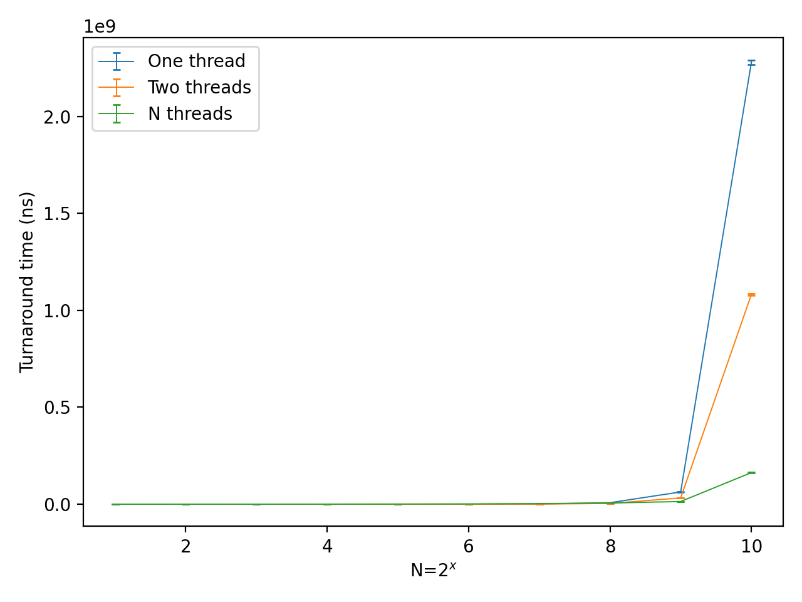

# 1 More on spinlocks

## Question-1

When the CPU takes a hardware interrupt it immediately saves the context of the thread that happened to be running, switches the privilege level to kernel mode, disables further interrupts (or at least masks the current interrupt line), and starts executing the interrupt service routine in what is called the interrupt context.

In this context the execution stack, the register conventions, and, most importantly, the locking‐discipline are quite different from those used by ordinary kernel code that is running on behalf of a thread. The ISR therefore has to finish its urgent bookkeeping first—usually acknowledging the device, recording a minimal state change, and queuing some follow‑up work before any normal scheduling decision can be made

During that brief window the scheduler deliberately leaves the previously running thread "frozen" rather than immediately resuming it, because the kernel still does not know whether the event that just arrived changes the set of runnable tasks. If the interrupt was simply the periodic timer tick used for time slicing, the ISR will increment accounting counters and set a flag (often called `need_resched`) telling the kernel that a reschedule should happen as soon as it is safe.

If the interrupt was an I/O completion that unblocks a different thread (for example, the disk finishes a read that thread B has been sleeping on, while thread A was on the CPU), the ISR will move thread B from a wait queue to the ready queue. In either case the identity of the "best" next thread is not known until after the ISR completes and normal kernel mode is restored; choosing prematurely would either overlook the newly woken thread or violate the one‑CPU‑at‑a‑time invariants inside the scheduler

Another reason is that ISRs execute with many kernel locks implicitly held or with pre‑emption disabled. Calling the full scheduler while those locks are held would risk deadlock and undermine the interrupt‑latency guarantees that interrupts exist to provide. So instead the ISR does only constant‑time work, sets bookkeeping flags, and returns. 

The return path from `iret` (or `sret`, `mret` in RISC‑V) is instrumented so that, just before control would fall back into user space, the kernel checks the reschedule flag. If it sees that flag it then enters the ordinary scheduling code in process context, at a point where the usual kernel locking rules apply and all runnable threads—including the one that was just woken by the interrupt—can be compared fairly

In short, while the processor is still in interrupt context the system cannot safely assume that the interrupted thread is still the right choice to run next, nor can it safely run the heavy machinery of the scheduler. Only after the ISR finishes and the kernel re‑enters its regular, thread‑aware execution path does it look at all runnable tasks and pick whichever should now receive the CPU, which might be the original thread, but might just as well be another one that became ready because of that very same interrupt

## Question-2

TBH I dont think the xv6 will have deadlock here, since there is an check for the CPU id, so the lock should not be stolen, which would cause an panic:

```c
void
release(struct spinlock *lk)
{
  if(!holding(lk))
    panic("release");
  
  ...
}
```

So Im supposing that the two checks here didnt exist, or said it would keep going without causing panic, to continue the precondition "The lock is stolen".

`release()` is written with the assumption that the CPU that calls it is exactly the one that executed `acquire()`:

- the caller already has interrupts off, because `acquire()` executed `push_off()`.
- the caller’s per‑CPU nesting counter `noff` therefore already equals `N + 1`, where `N` is the depth of any earlier `push_off()` calls made by this CPU.
- the `pop_off()` at the tail of `release()` will bring `noff` back to `N` and may re‑enable interrupts.
- the `cpu` field inside the lock still names the releasing CPU, so the ownership test in `holding()` works.

If some other thread "steals" the lock, those assumptions collapse. The most dangerous mismatch is the interrupt state:

| CPU that *took* the lock (A)                 | CPU that *steals* the lock (B)                                                                                                                              |
| -------------------------------------------- | ----------------------------------------------------------------------------------------------------------------------------------------------------------- |
| `push_off()` → `noff ++` (interrupts go off) | **no** earlier `push_off()`                                                                                                                                 |
| … still inside the critical section …        | `release()` executes:<br>  `pop_off()` → `noff – 1` (goes negative → would panic, but suppose the panic is disabled)<br>  interrupts on **B** may turn *on* |

Meanwhile CPU A keeps running with interrupts disabled but no longer owns the lock that is supposed to protect the data it is touching.

Thus, the deadlock may happend, imagine two independent spin‑locks, L1 and L2.

- T0 (CPU A)：`push_off()` disables interrupts, then `acquire(L1)`. A now owns L1 with interrupts off.
- T1 (CPU A)：`acquire(L2)` succeeds. A owns both `L1` and `L2`, still with interrupts off.
- T2 (CPU B)：(by mistake) calls `release(L1)`. Because B never called `push_off()`, the `pop_off()` at the end of `release()` decrements B’s `noff` counter and re‑enables its interrupts. The line `__sync_lock_release(&L1.locked)` sets `L1.locked = 0`.
- T3 (CPU C)：`push_off()` disables interrupts, then `acquire(L1)` sees the zero and succeeds. C now owns `L1`, still with interrupts off.
- T4 (CPU C)：C tries to `acquire(L2)` but fails, because A is still holding it. C begins spinning—still with interrupts off—waiting for L2 to become free.
- T5 (CPU A)：A finishes its work. It first `release(L2)` (succeeds), then tries to `release(L1)`. But L1 is now owned by C, so A spins waiting for `L1.locked` to drop to 0—also with interrupts off.

At this point:

- CPU A is spinning on L1 with interrupts disabled.
- CPU C is spinning on L2 with interrupts disabled.
- Each CPU is waiting for a lock that can be freed only by the other CPU, yet neither can receive the timer interrupt that would pre‑empt it, because both turned interrupts off with push_off().
- The system has entered a cycle of mutual "exclusion + no pre‑emption" → deadlock.

This is an deliberately hand-made example so the process may be weird, like the CPU B can mistakely release L1 but CPU A cant mistakely release L2. But anyway, I think the key concept did be explained here.

## Question-3

When the code inside a critical section executes in only a few tens or hundreds of CPU cycles, the fixed cost of a context‑switch dominates every other consideration. Putting a thread to sleep involves saving its register state, manipulating scheduler queues, issuing an inter‑processor interrupt to awaken another CPU, invalidating and repopulating cache lines, and later performing the whole sequence again to wake the original thread. On most machines that sequence costs several microseconds—thousands of cycles. 

By contrast, spinning in a tight loop that repeatedly issues one atomic read‑modify‑write instruction (such as `amoswap.w` or `lock xchg`) costs on the order of a handful of cycles each time it tests the lock and a few dozen cycles when it finally acquires it. If the protected code runs to completion in, say, 100 cycles, then even a short sleep makes the thread wait far longer than simply burning those 100 cycles in a spin loop.

# 2 Learning by teaching

There is an simple code I wrote before for my friend: [video demo](https://www.youtube.com/watch?v=I1nM207KStg)

## 1. Why we need to synchronize producers and consumers

I told `5568ke` to picture a single bowl that can hold exactly one cookie. I am the baker (producer) and he is the eater (consumer). If I drop a new cookie into the bowl while one is already there, the second cookie falls onto the floor and is wasted. If he reaches for a cookie while the bowl is empty, he grabs air and stays hungry.

To avoid both situations we must take turns in a disciplined way—the baker may fill the bowl only when it is empty, and the eater may take a cookie only when it is full. That disciplined "taking turns" is what computer scientists call synchronization.

## 2. How a semaphore helps

Next I showed `5568ke` a toy traffic‑light made of two cards, one green and one red, fixed back‑to‑back on a stick. Only one face is visible at a time. We agree: green = "bowl empty, baker may bake"; red = "bowl full, eater may eat."

Standing rules:

- When I (the baker) see green, I place exactly one cookie, flip to red, and step back.
- When `5568ke` sees red, he takes the cookie, flips to green, and steps back.

This stick behaves exactly like a semaphore whose value is either 0 or 1. The act of checking the color and possibly flipping it maps to the atomic P() / V() operations in operating‐system jargon.

Because the flip is atomic, neither of us can see an out‑of‑date state; therefore the bowl never overflows and `5568ke` never waits forever on emptiness.

## 3. How misuse of semaphores can deadlock

Then I asked `5568ke` to imagine we mistakenly add a second stick—each of us now checks two sticks before acting, but in opposite orders:

- Baker: "stick‑A first, then stick‑B"
- Eater: "stick‑B first, then stick‑A"

Both sticks start green. The baker flips A to red, intending to go on to B, but is pre‑empted. The eater flips B to red and now waits for A to turn green again; meanwhile the baker is waiting for B to turn green again. Neither side can proceed, the bowl stays empty, and both of us wait forever—this stalemate is deadlock. It happens because we used more than one semaphore and claimed them in inconsistent order.

## Question

> Is there ever a situation where spinning would be better than using your traffic‑light sticks?

My answer:

Yes.

If baking a cookie took only a millisecond and we were in a kitchen with ten bakers and ten eaters (multiple CPU cores), it could be faster for an eater to just peek at the bowl repeatedly (busy‑wait) instead of interacting with sticks that force everyone to line up.

The wasted “peeking” time is tiny compared with the overhead of agreeing on sticks, especially when another baker is almost certain to produce a cookie very soon.

# 3 Multi-thread programming 

```bash
$ lscpu
Architecture:             x86_64
  CPU op-mode(s):         32-bit, 64-bit
  Address sizes:          46 bits physical, 48 bits virtual
  Byte Order:             Little Endian
CPU(s):                   24
  On-line CPU(s) list:    0-23
Vendor ID:                GenuineIntel
  Model name:             13th Gen Intel(R) Core(TM) i7-13700
    CPU family:           6
    Model:                183
    Thread(s) per core:   2
    Core(s) per socket:   12
    Socket(s):            1
    Stepping:             1
    BogoMIPS:             4224.00
    Flags:                fpu vme de pse tsc msr pae mce cx8 apic sep mtrr pge mca cmov pat pse36 clflush
                           mmx fxsr sse sse2 ss ht syscall nx pdpe1gb rdtscp lm constant_tsc rep_good nop
                          l xtopology tsc_reliable nonstop_tsc cpuid pni pclmulqdq vmx ssse3 fma cx16 pci
                          d sse4_1 sse4_2 x2apic movbe popcnt tsc_deadline_timer aes xsave avx f16c rdran
                          d hypervisor lahf_lm abm 3dnowprefetch invpcid_single ssbd ibrs ibpb stibp ibrs
                          _enhanced tpr_shadow vnmi ept vpid ept_ad fsgsbase tsc_adjust bmi1 avx2 smep bm
                          i2 erms invpcid rdseed adx smap clflushopt clwb sha_ni xsaveopt xsavec xgetbv1 
                          xsaves avx_vnni umip waitpkg gfni vaes vpclmulqdq rdpid movdiri movdir64b fsrm 
                          md_clear serialize flush_l1d arch_capabilities
Virtualization features:  
  Virtualization:         VT-x
  Hypervisor vendor:      Microsoft
  Virtualization type:    full
Caches (sum of all):      
  L1d:                    576 KiB (12 instances)
  L1i:                    384 KiB (12 instances)
  L2:                     24 MiB (12 instances)
  L3:                     30 MiB (1 instance)
Vulnerabilities:          
  Gather data sampling:   Not affected
  Itlb multihit:          Not affected
  L1tf:                   Not affected
  Mds:                    Not affected
  Meltdown:               Not affected
  Mmio stale data:        Not affected
  Reg file data sampling: Vulnerable: No microcode
  Retbleed:               Mitigation; Enhanced IBRS
  Spec rstack overflow:   Not affected
  Spec store bypass:      Mitigation; Speculative Store Bypass disabled via prctl and seccomp
  Spectre v1:             Mitigation; usercopy/swapgs barriers and __user pointer sanitization
  Spectre v2:             Mitigation; Enhanced / Automatic IBRS; IBPB conditional; RSB filling; PBRSB-eIB
                          RS SW sequence; BHI BHI_DIS_S
  Srbds:                  Not affected
  Tsx async abort:        Not affected
```



The code is in `matrix_mul_pthreads.c`

| N (=2^x)  | fastest version | reason                                                                                                                                                                                                                                                                                                |
| --------- | --------------- | ----------------------------------------------------------------------------------------------------------------------------------------------------------------------------------------------------------------------------------------------------------------------------------------------------- |
| 2 … 64    | **1 thread**    | Workload (<75 k ops) is smaller than the *cost* of spawning & joining threads and moving cache‑lines between cores                                                                                                                                                                                    |
| 128 & 256 | **2 threads**   | 2 physical cores execute ≈ 2 M–17 M ops fully in parallel while matrices still fit in the shared 30 MiB L3; creating 128 or 256 threads would only burden the scheduler                                                                                                                               |
| ≥ 512     | **N threads**   | I think working set (≥ 0.5 GiB) is memory‑bound.  Hundreds of row‑workers keep many cache misses in flight, hiding DRAM latency.  At **1024 × 1024** the row‑parallel version is **14× faster** than the sequential baseline, even though Linux has to time‑slice 1024 user threads onto 24 hardware contexts |

There are some point for this question:

- **Thread‑management overhead dominates small problems**  
  For N ≤ 64 the arithmetic body of the loop finishes in micro‑seconds, while each `pthread_create / join` pair costs tens of micro‑seconds.
- **Cache capacity vs. core count**  
  At N = 128 the entire A and B tiles assigned to each of the two workers still reside in L2/L3, so doubling cores gives almost perfect scaling. Creating 128 threads would provide no extra parallelism but would thrash the shared caches.
- **Memory‑bandwidth saturation**  
  From N = 512 upward the computation is limited by the single DDR5 channel. Having many row‑workers issues enough outstanding reads to saturate the memory controller, so wall‑time falls even though most threads spend the bulk of their time stalled on RAM.
- **Scheduler limits**  
  Once the number of runnable threads far exceeds 24, Linux multiplexes them with negligible additional overhead because each blocked worker is simply waiting for data. Hence the “N threads” curve keeps dropping while the “2 threads” curve flattens.

My personal experience for developing `rv32emu`(`semu`) is that these kind of problem can be really complicated. I think the influence of scheduler and cache can be very different for each environment. It also somehow has some temporal-locality-like behavior, the data tested in one day can be very closed to each other, but very different with the data tested at the other days. Also, the cost of `clock_gettime` actually cant be ignored, it does contribute part of the cost even though the vDSO exist.

Related issue/PR：[RCU CPU stall warning in a multi-core system simulation](https://github.com/sysprog21/semu/issues/51)

# 4 Xv6 kernel programming

First, add a small circular buffer with size 5, and record the cnt, head and current index:

```c
#define HIST_SIZE   5

static char history[HIST_SIZE][INPUT_BUF_SIZE];
static int  hist_cnt = 0;    // how many valid entries (0‑5)
static int  hist_head = 0;   // next slot to overwrite
static int  hist_cur  = -1;  // -1 = not browsing, else 0‑(hist_cnt‑1)
```

Then, store the command in the existing `default:` part:

```c
if(c == '\n' || c == C('D') || cons.e-cons.r == INPUT_BUF_SIZE){
  // wake up consoleread() if a whole line (or end-of-file)
  // has arrived.
  if (c == '\n') {
    // copy from last newline (or cons.w) up to current '\n'
    int len = 0;
    for (int idx = cons.w; idx < cons.e && len < INPUT_BUF_SIZE-1; idx++)
      history[hist_head][len++] = cons.buf[idx % INPUT_BUF_SIZE];
    history[hist_head][len] = '\0';

    hist_head = (hist_head + 1) % HIST_SIZE;
    if (hist_cnt < HIST_SIZE) hist_cnt++;
    hist_cur = -1;               // reset browsing state
  }

  cons.w = cons.e;
  wakeup(&cons.r);
}
```

Then, add an helper function to clear the command line, I just do this like keep pressing DELETE key:

```c
static void
clear_line(void)
{
  // delete everything
  while (cons.e != cons.w) {
    cons.e--;
    consputc(BACKSPACE);
  }
}
```

Finally, handle the input for `CTRL+W` and `CTRL+S` in the function `consoleintr`:

```c
switch(c){
case C('W'): {                   // browse older
  if (hist_cnt == 0 || hist_cur + 1 >= hist_cnt) 
    break;

  hist_cur++;
  clear_line();

  // print the requested line and copy it into input buffer
  char *line = history[(hist_head - 1 - hist_cur + HIST_SIZE) % HIST_SIZE];
  for (int i = 0; line[i] && cons.e - cons.r < INPUT_BUF_SIZE; i++) {
    consputc(line[i]);
    cons.buf[cons.e++ % INPUT_BUF_SIZE] = line[i];
  }
  break;
}
case C('S'): {                   // browse newer
  if (hist_cnt == 0) 
    break;

  if(hist_cur <= -1) {          // clear whole line
    clear_line();
    break;
  }
    
  hist_cur--;
  clear_line();

  if (hist_cur == -1)
    break;                       // show empty prompt

  char *line = history[(hist_head - 1 - hist_cur + HIST_SIZE) % HIST_SIZE];
  for (int i = 0; line[i] && cons.e - cons.r < INPUT_BUF_SIZE; i++) {
    consputc(line[i]);
    cons.buf[cons.e++ % INPUT_BUF_SIZE] = line[i];
  }
  break;
}

...
}
```

If the buffer is empty, or it cross the capacity of exist elements num, brek. Then clear the line and put the stored command.

The full code was in the `console.c`
