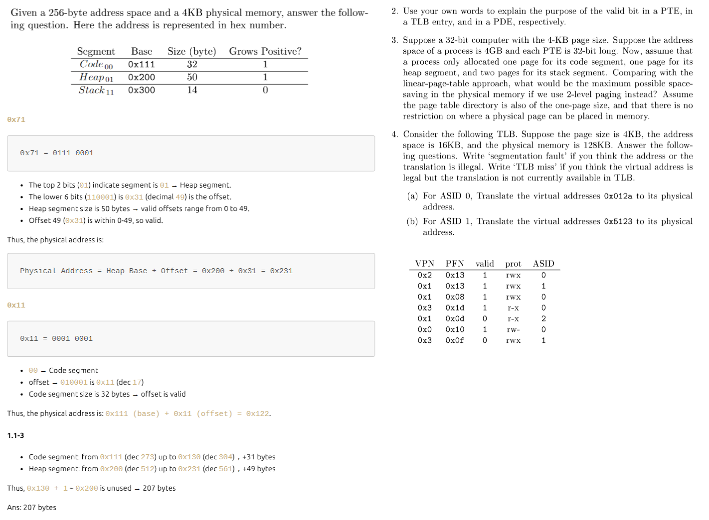
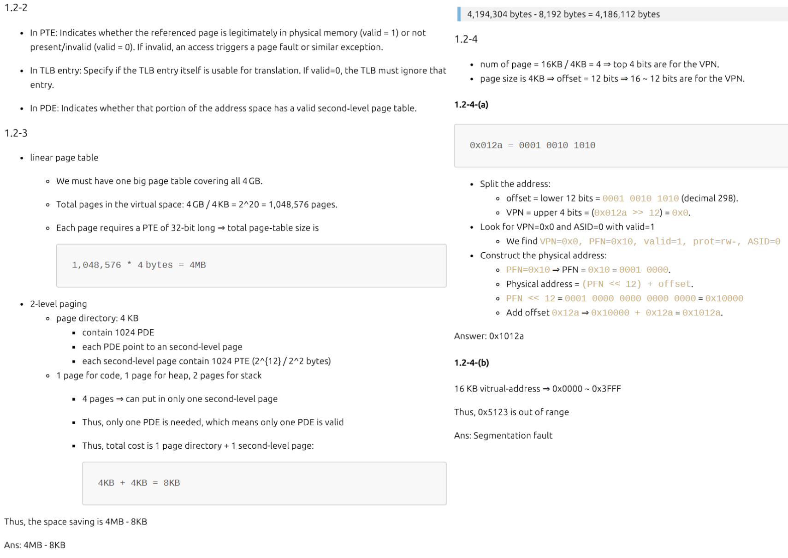

### CPU Scheduling

- 周轉時間（T_turnaround）= 完成時間（T_completion）- 到達時間（T_arrival）
  - 成本：A:100、B:10、C:10
    - FIFO 先到先做 ⮕ 周轉時間 = (100 + (110 - 0) + (120 - 0)) / 3 = 110
    - 最短任務優先(SJF)：從清單中找成本最低的先做
      - 如果 A 先到那成本一樣會變很大（100 +（110−10）+（120−10））/3 = 103.33
    - 最短完成時間優先（STCF）：可以搶佔，新工作進來會確認誰剩餘時間最少，然後讓他搶佔並工作
- 響應時間（Response Time）= 首次運行時間（T_firstrun）− 到達時間（Tarrival）
  - Round-Robin（time-slicing）：固定時間片，每個任務執行固定時間後換其他人
    - 時間片越短響應時間越好，但 context switch 成本越高
    - 公平，但這也代表周轉指標表現不佳
    - RR 響應時間 =（0 + 1 + 2）/ 3 = 1，SJF 響應時間 =（0 + 5 + 10）/ 3 = 5
- 結合 I/O：假設 A 每執行 10 ms 發 I/O 請求，B 只使用 CPU 50ms，則會將 A 每 10ms 的子工作視為獨立工作， 所以排成時是在選要執行 10ms 的 A 還是 50ms 的 B，達到交互效果，但實務上無法預知工作長度所以有困難
- Multi-level Feedback Queue（MLFQ）
  - 有許多獨立的隊列，每個隊列有不同優先級，一個工作只能存在於一個對列中，MLFQ 會優先執行較高優先級的工作，同優先級的則使用 RR
    - 工作進來會先放在最高優先級；如果用完整個時間片，則降低優先級（移到下一個隊列）；如果在時間片內主動釋放 CPU 則優先級不變
  - 有飢餓（starvation）的問題，低優先級的工作會得不到 CPU。 再來會有惡意程式（game the scheduler），透過在時間片快用完時調用 I/O 來主動釋放 CPU，以維持高優先級
  - 解決飢餓問題：每經過一段時間就將系統中所有工作弄回最高優先級，這個時間稱為 voo-doo constant，設太高會有飢餓，設太低需要 I/O 的工作會拿到的 CPU 會變很少
  - 解決惡意程式：工作用完了某一層中的時間配額就降低優先級，不管中間主動放棄了多少次 CPU
- proportional-share（fair-share）Scheduling
  - 關注在公平，而不是優化周轉和響應指標，最有名的是 Lottery Scheduling（彩票機制）
  - 會有彩票數（ticket），代表程序佔有資源的份額；假設 A 有 75 張，B 有 25 張，則 A 會佔用 75% 的 CPU 時間，因為彩票機制利用隨機性每次抽一張票，被抽到的程序會被運行
  - 三個優點：可以避免 corner-case、成本很小（不需要記錄任何狀態）與很快（成本只在生成隨機數）
  - 缺點：不適合 I/O、票數分配不好分
  - 有一種變形是步長排程：每個工作有自己的步長，值與票數成反比；挑總步長最短的執行，執行完加家步長到總步長中
- 多核情景
  - 單隊列多核排程（Single Queue Multiprocessor Scheduling，SQMS）
    - 優點：只有一個 queue，簡單
    - 缺點：缺乏 scalability 因為需要鎖；cache affinity 不好，不同任務會在不同 CPU 之間亂跑（固定在一個上較好）
  - 多隊列多核排程（Multi-Queue Multiprocessor Scheduling，MQMS）
    - 優點：好的 scalability，每個 CPU 都有自己的隊列，自己選要執行誰；好的 cache affinity，因為隊列是 per CPU 的
    - 會有 load imbalance 的問題，因此需要 migration 機制，實作上可以用 work stealing，自己的隊列空了去別地方偷

### VM

- Segmentation：用 Segment bit 選 Base，位址 = Base + offset
- Paging：用 VPN 轉換成 Base，位址算法一樣，多層的話 VPN 會分成給 PD 和 PT 的 bit，用 PD 找 PT，再用 PT 轉換成 Base
- offset bit 對應到 page 大小，VPN bit 對應到有幾個 PTE（頁表大小 / PTE 大小），VPN bit + offset bit = N-bit address space

